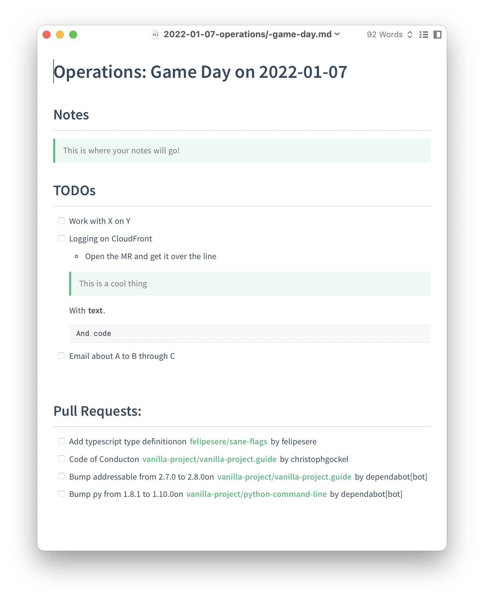

[](https://codecov.io/gh/felipesere/journal)

# `journal`

Journal is a small tool to keep track of TODOs, notes, and reminders in simple Markdown files.
It can also get a list of open PullRequests from Github.

One of `journal`s core tennets is to keep all data local. It only fetches data from remote sources (GitHub, if enabled) but will never store it outside of the computer it is running on. This keeps the tool simple, privacy aware, and capable of running offline. It also gives you the freedom to use your own tools for editing files and searching across them.




## Configuration

Configuration can be placed anywhere and referenced with `JOURNAL__CONFIG` which defaults to `$HOME/journal.config.yml`.

The minimal content of the config should look like this:

```yaml
dir: "/Users/$your-name/journal"
```

where `dir` tells `journal` where to store the markdown files.

You can also adjust that value on each call using `JOURNAL__DIR=/different/location`.

You can enable reminders by simply adding it to the config:

```yaml
dir: "/Users/$your-name/journal"

reminders:
  enabled: true
```

or via an environment variables: `JOURNAL__REMINDERS__ENABLED=true`.
This can also be used to temporarily disable them.

Configuring Github is a bit more intricate.
You'll need a personal Github access token with read permissions.

Then, you can select in which repos to look for PullRequests like so:

```yaml
pull_requests:
  enabled: true
  auth:
    personal_access_token: "your-access-token"
  select:
    - repo: felipesere/journal
    - org: vanilla-project
      authors:
        - tom.bombadil
        - gandalf
    - org: my-corp-org
      labels:
        - dependencies
        - team-apollo
        - team-mars
```

Hopefully the `auth` section is self-explanatory.
The `select` section lets you pick PullRequests either in individual repositories (`repo`)
or across an entire organization (`org`).
You can then apply two kinds of filters: `authors` and `labels`.
Each takes a list of possible values that are treated like logical OR-statements.
If any of the labels is present or any of the authors match, they will be shown in the journal entry.

# Usage

To create a new entry
```sh
journal new "This is the title"
```

if you just want to print it to standout instead of creating a file, you can pass the `--stdout` or `-s` flag.

## Working with `TODOs`

Any TODOs that you check of at the top-level will be filtered out the next time you create a new journal page.

## Working with Reminders

You can have `journal` remind you of events:

`journal reminders new --on Wedneday "Send @jessica the latest marketing figures"`

It supports two kinds of events:

* one-time events on specific dates/days using `--on ...`
* recurring events using `--every`

The table below shows the different variants:

| Example usage                            | Meaning                         |
| ---------------------------------------- | ------------------------------- |
| `--on $WEEKDAY` like `--on Monday` ...   | On next `$WEEKDAY`, e.g. Monday |
| `--on 15.Jan` or  `--on 15.Jan.2022` ... | On that specific day            |
| `--every $WEEKDAY` like `--every Monday` | Every `$WEEKDAY`                |
| `--every 2.days` or `--every 3.weeks`    | Repeat every `n` interval       |

Example:
```sh
journal reminders new --every 3.days "Check in with team Apollo about X"
```

You can also manipulate the reminders by listing and deleting them:

```sh
$ journal reminders new --every 3.days "Check in with team Apollo"
Added a reminder for 'Check in with team Apollo' every '3 Days'

$ journal reminders list
┌────┬──────────────┬───────────────────────────────────┐
│ nr │ date         │ reminder                          │
├────┼──────────────┼───────────────────────────────────┤
│ 1  │ every 3 Days │ Check in with team Apollo about X │
└────┴──────────────┴───────────────────────────────────┘


journal reminders delete 1
Deleted 1

$ journal reminders list
┌────┌──────┬──────────┐
│ nr │ date │ reminder │
└────┴──────┴──────────┘
```
